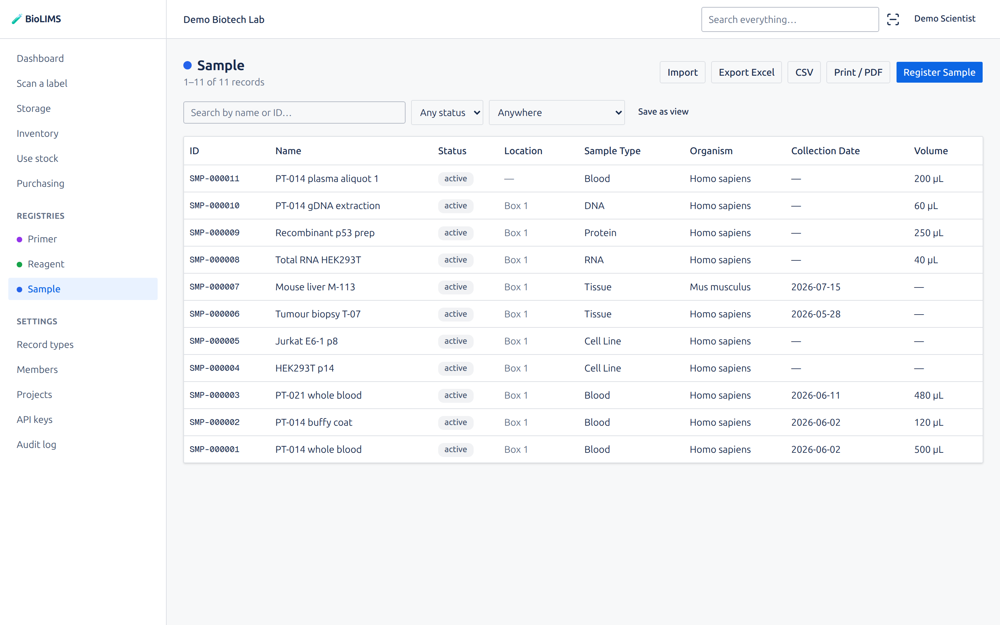
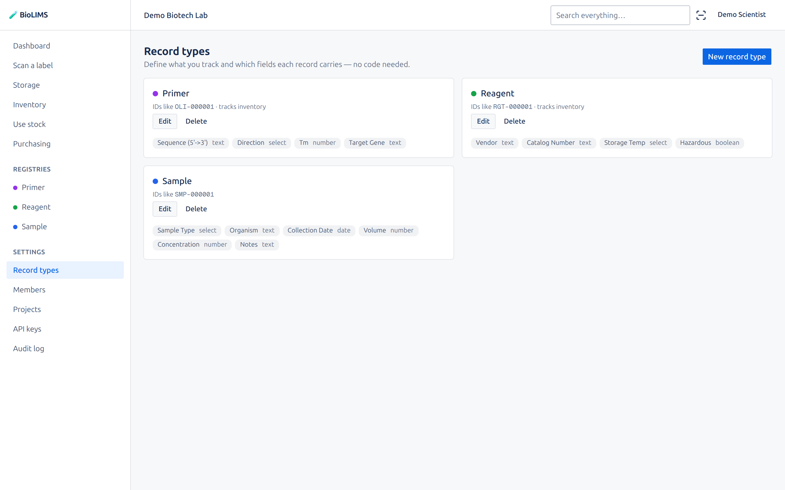
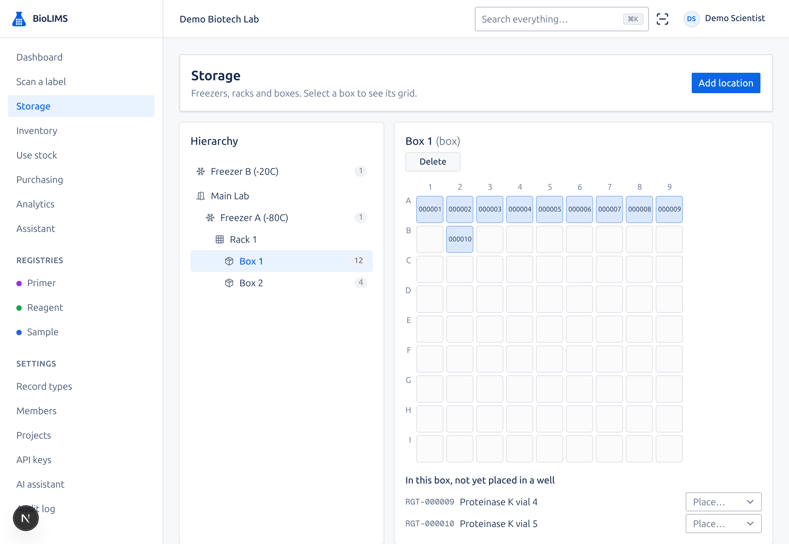
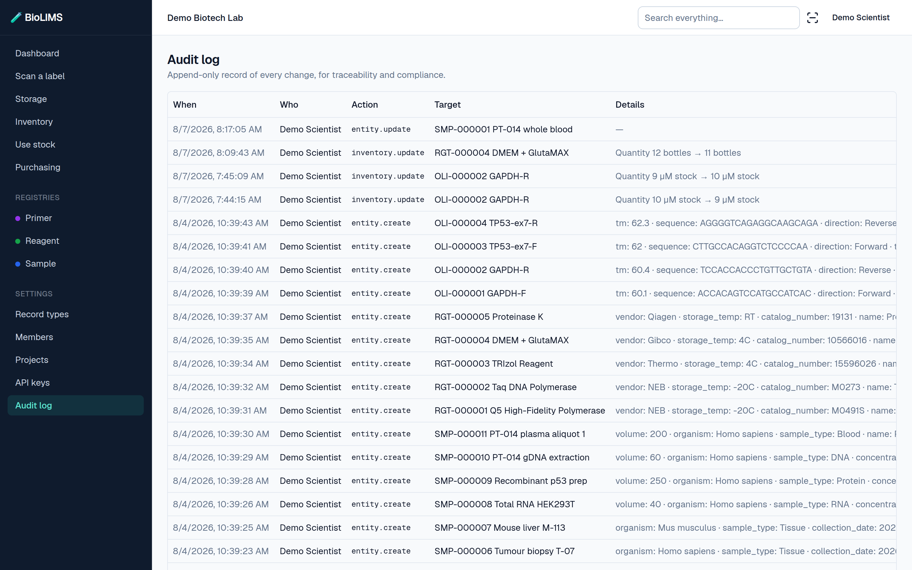

<div align="center">

# 🧪 BioLIMS

### Your lab deserves better than a sample spreadsheet.

Open-source sample, reagent and freezer tracking built for academic research groups —
free for everyone in the lab, no purchase order, no vendor.

**[🌐 biolims.github.io](https://bioliams.github.io)** · **[▶ Try the live demo](https://bioliams.vercel.app)**

No signup — sign in with `demo@biolims.dev` / `biolims-demo`

[](LICENSE)




</div>

---

## The problem with lab software

Sample management in most academic labs is a shared spreadsheet — and the alternative is
priced for pharma, not for a departmental budget.

The spreadsheet works right up until someone asks *"where is that sample now?"* or
*"which aliquots came from patient 014?"* — and nobody can answer without walking to a
freezer and phoning the student who made them, who graduated last year.

Commercial platforms answer those questions, but they charge per seat, need a purchase
order and months of setup, and model your science the way their vendor imagined it. Adding
a field can mean a support ticket.

**BioLIMS is the third option.** Real sample tracking, at spreadsheet cost.

---

## Why BioLIMS is different

### 🧬 You define what you track

Most systems ship a fixed `Sample` table and expect your science to fit it. BioLIMS ships
with sensible starters — Sample, Reagent, Primer — and then gets out of the way.

Track cell lines with passage numbers. Mouse colonies with cage IDs. Plasmids with backbone
and resistance marker. Build the record type in the browser, pick your fields, done. No
schema migration, no developer, no ticket.



### 🔓 Your data, your server, no per-seat bill

MIT licensed. Run it on a spare machine in the lab, or on a cloud account you control.
Add your whole team without watching a licence counter. Export everything to CSV whenever
you want, because it's your data and it lives in your Postgres database.

No sales call. No quote. No minimum seats.

### ⚡ Configured in an afternoon, not a quarter

There is no implementation project. Sign up, name your lab, and you have starter record
types and a freezer tree already in place. Most labs are registering real samples the same
day.

---

## What you can do

**📍 Find any sample, down to the well.** Model your real storage — site, room, freezer,
shelf, rack, box — and place samples in specific positions. Open a box and see exactly
what's in it and what's free. No more opening three freezers to find one tube.



**🧫 Follow the lineage.** Aliquots and extractions stay linked to what they came from.
Open a gDNA prep and see the blood draw it started as, or open the draw and see everything
derived from it.

**📦 Stop running out of reagents.** Track quantities, lots and expiry. Set a minimum and
low-stock items surface on the dashboard before the experiment stops.

**🕓 Answer "who changed this?" instantly.** Every create, edit, move and delete is written
to an append-only log with the person, the timestamp and what changed — per record and
lab-wide.



**📥 Bring your spreadsheet with you.** Import a CSV and BioLIMS matches your columns to
your fields, validating as it goes and telling you exactly which rows need attention.
Export any registry back out at any time.

**🔌 Script it.** Everything the interface does is available over a REST API with per-lab
keys, so a notebook can register samples, look up storage, or pull a dataset for analysis.

```python
import requests

requests.post(
    "https://your-lab.example.com/api/v1/entities",
    headers={"Authorization": f"Bearer {BIOLIMS_KEY}"},
    json={
        "type": "sample",
        "name": "PT-014 gDNA",
        "data": {"sample_type": "DNA", "concentration": 88.4},
    },
)
```

**👥 Built for a team.** Invite colleagues, assign roles, and work in the same lab. Every
query is scoped to your organization, so labs sharing an instance never see each other's
data.

---

## Try it

The fastest way to judge it is to click around the [**live demo**](https://bioliams.vercel.app)
— it's a populated lab with samples in freezer boxes, low-stock reagents and a full
audit trail.

> Sign in with `demo@biolims.dev` / `biolims-demo`.
> It's a shared public sandbox, so expect other people's edits in there. Don't put anything
> real in it.

### Run your own

You need Docker and about two minutes.

```bash
git clone https://github.com/bioliams/bioliams.git
cd bioliams
echo "BETTER_AUTH_SECRET=$(openssl rand -base64 32)" > .env
docker compose --profile prod up -d --build
docker compose exec app npm run db:migrate
```

Open http://localhost:3000, create your account, name your lab. That's the whole
installation.

Deploying to a server or a cloud platform instead? See **[DEPLOYMENT.md](DEPLOYMENT.md)**.

---

## Where the project is today

**v0.1 — the sample-tracking core is complete and in use.** Everything described above
works today. It is young software: expect rough edges, and please report them.

**Shipped since v0.1:**

| | |
|---|---|
| 🔄 **Stock as events** | Consume, adjust, split and receive recorded as movements, not an overwritten number |
| ✂️ **Aliquots** | Split a batch into individually tracked vials across several freezers |
| 🏷️ **Barcodes & labels** | A QR on every record, printable label sheets, phone and USB scanning |
| 📱 **Installable app** | Add to a phone home screen, scan at the bench, honest offline behaviour |
| 🔎 **Search, sorting & saved views** | Lab-wide search including custom fields, sortable columns, shared saved views |
| 📤 **Excel in and out** | Import .xlsx or CSV, export a real spreadsheet, print any registry to PDF |
| 👥 **Roles** | Owner, admin, member, storage manager and read-only, enforced server-side |
| 🛒 **Purchasing** | Request → approve → order → receive, topping up stock on arrival |
| 💾 **Backup guide** | A restore you have actually practised — see [BACKUPS.md](BACKUPS.md) |

**Planned next:**

| | |
|---|---|
| 📓 **Electronic lab notebook** | Experiment write-ups linked to the samples they used |
| ⚙️ **Workflow automation** | Multi-step protocols with task assignment and sample state |
| 🔬 **Instrument integrations** | Turn plate reader, qPCR and sequencer output into records |
| 🛡️ **Operations & security** | Encryption, MFA and SSO, stable API versioning, security reporting |
| ✍️ **Electronic signatures** | Reviewed-and-approved sign-off on records |
| 📋 **Validation & compliance** | GAMP 5 pre-validation, and the controls regulated labs need for 21 CFR Part 11 and EudraLex Annex 11 |
| 🐍 **Python client** | A proper `biolims` package for notebook users |
| 🗂️ **Project-level access** | Scoping records to projects, so collaborators see only their own |

---

## Contributing

The most useful contribution isn't always code. If you run a lab and something here is
wrong, awkward, or missing, [**open an issue**](https://github.com/bioliams/bioliams/issues)
— knowing which of the roadmap items actually matters shapes what gets built next.

If you do want to build: **[CONTRIBUTING.md](CONTRIBUTING.md)** covers the architecture and
how to get a development environment running.

## License

MIT — see [LICENSE](LICENSE). Use it, fork it, run it commercially. It's yours.
